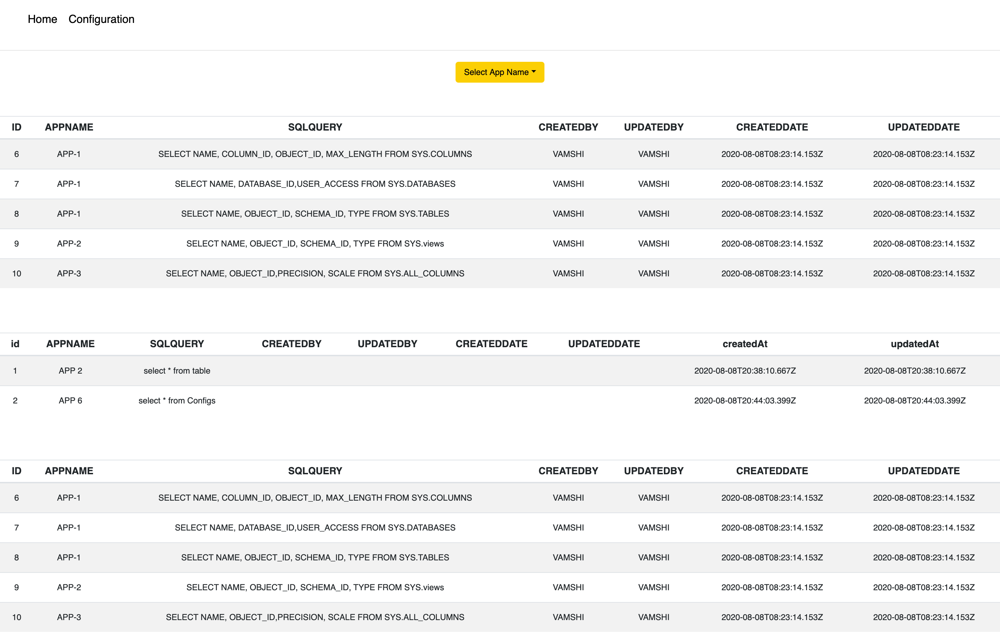
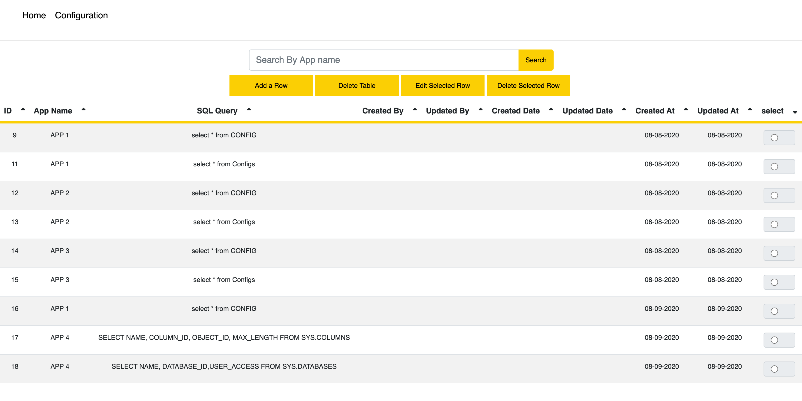

# gridLayoutReactNode
exposing mssql data via node using sequelize and showing data in a grid 
# running React Project
Clone the whole workspace into the same directory using git clone {URL}, go into the ReactProject using terminal and type npm install to install the node_modules and then type npm start.

# running Node Project
Go into the NodeProject using terminal, type npm install to install the node_modules and type node server.js.
